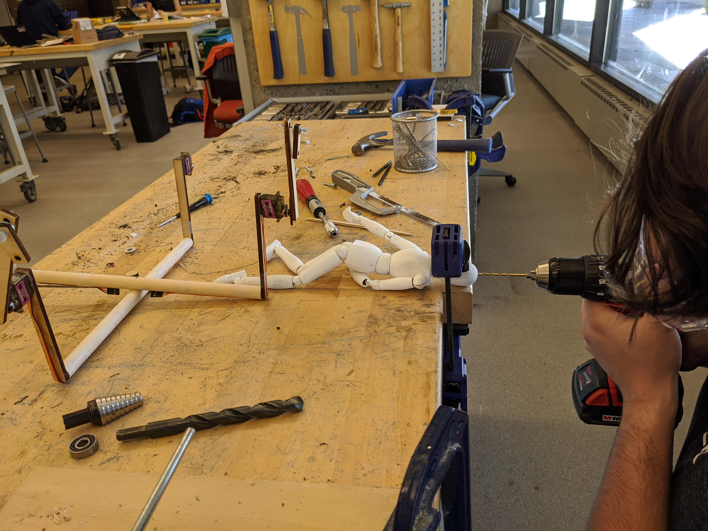
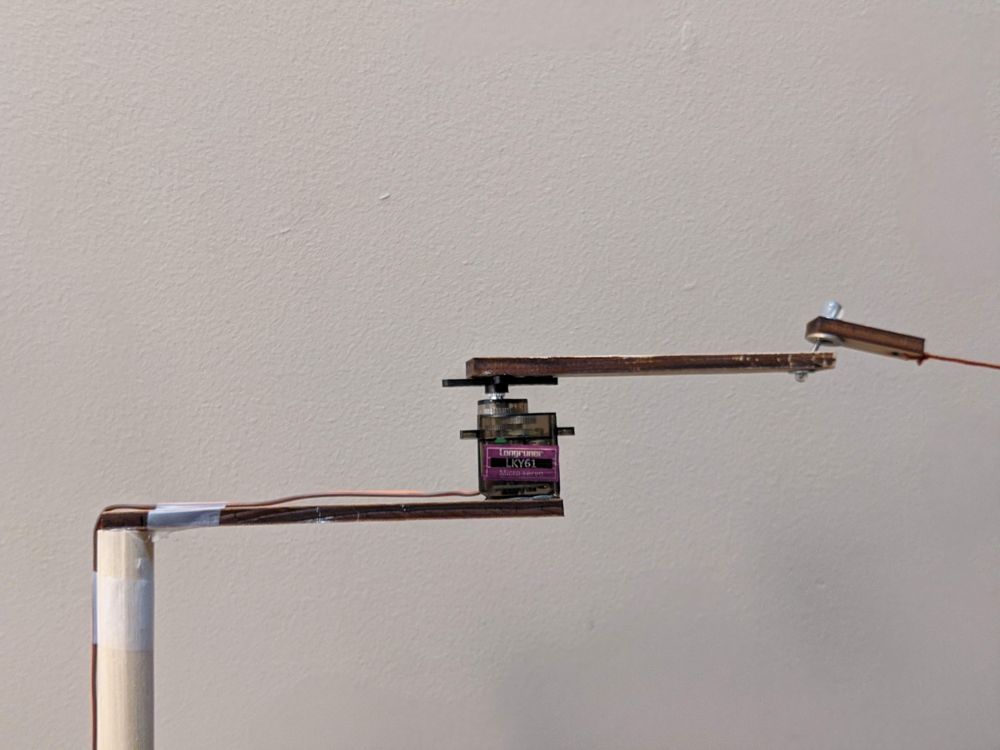
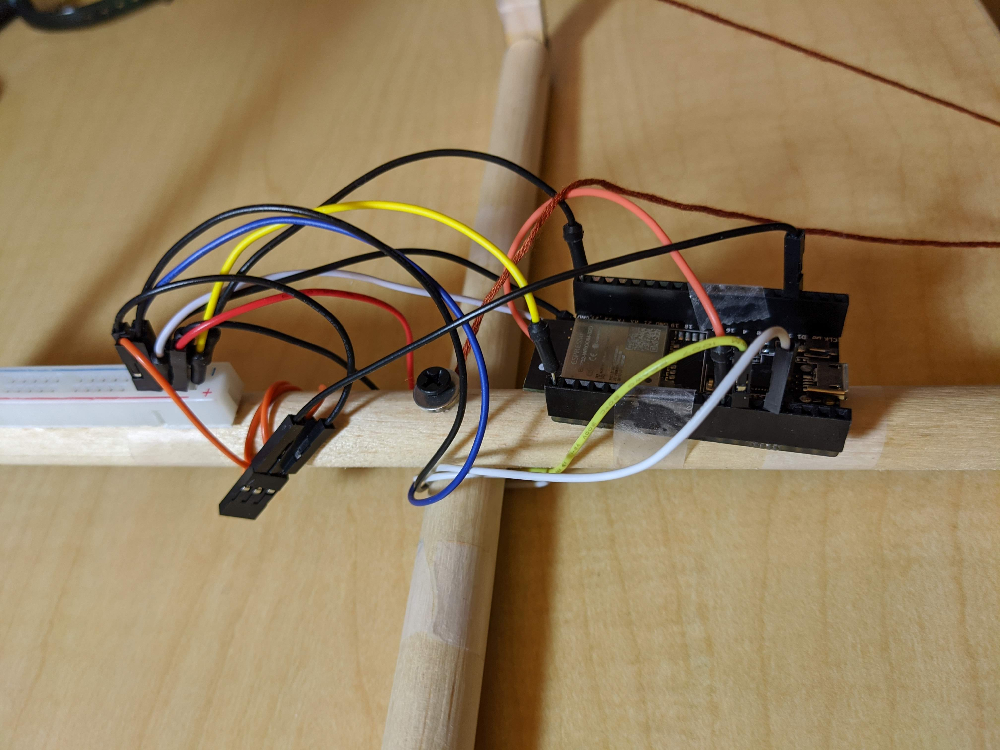

# Motornette
### Created by Grace Cheung and Sabrina Long
A dancing marionette, animated with motors

## Overview

Motornette is a dancing marionette powered by four servo motors. Users can control motornette's dance moves by pressing the arrow keys on a laptop. Each key controls a different limb. This peace is meant to emulate the movements of a puppeteer with actuators, instead of fine hand movements.

## Hardware Build

**Parts**

Puppet:
- 12-inch wooden dowel (x2)
- 0.5 x 5 inch wooden supports (x4)
- 0.5 x 4.3 inch wooden supports (x4)
- 0.4 x 1.3 inch wooden supports (x4)
- 1 inch nail (x4)
- Small washers (x10)
- Medium-size washers (x4)
- String
- Wooden doll
- 0.5 inch screws (x2)

Electronics
- Servo motors (x4)
- ESP32
- Breadboard
- Jumper wire

**Construction**

*Frame*:
- Hot glue the two wooden dowels together in a cross shape. You can file down one dowel at the center to create an indentation for easier gluing, if desired.
- Hot glue the 0.5 x 5 inch wooden supports to the end of each dowel, so that one end is attached to the dowel and the remaining 4.5+ inches are hanging down. Another option is to nail/drill the wooden supports into the dowel
- Hot glue the servo motors to the 0.5 x 5 inch wooden supports. The wires should face towards the top of the frame, to connect to the ESP32 that will be mounted to the cross.
- Drill a hole into the center of the wooden dowel cross, into the side facing downwards. Add a washer and screw into the hole. The screw does not need to be screwed in all the way.
- Drill a hole into the top of the marionette's head. Add a washer and screw into the hole. The screw does not need to be screwed in all the way. Attach a string (~2 ft) from the screw in the cross to the screw in the marionette.

*Piston*:
- Create the piston by threading the following items onto a nail, in this order: small washer, 0.5 x 4.3 inch wooden support, medium washer, 0.4 x 1.3 inch wooden support, small washer. 
- Add a ball hot glue on either side of the nail to create a stopper. Make sure the ball of glue is larger than the opening for the small washer.
- Glue the other end of the 0.5 x 4.3 inch wooden support to the servo motor rotator. Make sure that the small wooden support is facing outward.

*Final*:
- Arrange all of the pistons so that they are fully extended downwards, in line with the o.5 x 5 inch support pieces. Attach a string from each of the small wooden supports to each of the marionette's limbs. The strings should be fully extended when the marionette's arms and legs are in a lowered position. Make sure the strings are not too loose or tight, otherwise the marionette will not dance properly.
- Mount the ESP32 on the underside of the wooden cross. Attach a power/ground strip from a breadboard. Wire according to the Arduino code, such that the motor for each limb corresponds to the correct input pin on the ESP32.
- Tape or wrap wires to reduce clutter.

## Software for Motornette

Motornette is controlled by two programs:

*Arduino*: The Arduino component of this project must be flashed onto your ESP32. You can use the Arduino IDE to do this. This code controls the four servo motors that are pulling strings to make motornette dance. This program takes in serial input from Processing and uses these values to make motornette's limbs dance in a specific order.

*Processing*: The Processing component of this project takes keyboard input and sends the input to the ESP32 through a serial port. To start the program and start communicating with motornette, you must run the Processing code. Then, use the arrow keys to move each one of motornette's limbs.You can press as many arrow keys as you want. This will just make motornette dance for longer. Press SHIFT to send the commands to the ESP32.

*Key Controls*:
- Left arm: LEFT
- Right arm: RIGHT
- Left leg: UP
- Right leg: DOWN
- Send data: SHIFT
